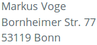
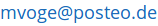

  
# Imprint / Impressum {#first-section}

## Angaben gemäß § 5 TMG:

## Kontakt:

E-Mail:
<noscript></noscript> 
Verantwortlich für den Inhalt nach § 55 Abs. 2 RStV: Markus Voge

Quelle: http://www.e-recht24.de

## Haftungsausschluss (Disclaimer)

### Haftung für Inhalte

Als Diensteanbieter sind wir gemäß § 7 Abs.1 TMG für eigene Inhalte auf diesen Seiten nach den allgemeinen Gesetzen verantwortlich. Nach §§ 8 bis 10 TMG sind wir als Diensteanbieter jedoch nicht verpflichtet, übermittelte oder gespeicherte fremde Informationen zu überwachen oder nach Umständen zu forschen, die auf eine rechtswidrige Tätigkeit hinweisen. Verpflichtungen zur Entfernung oder Sperrung der Nutzung von Informationen nach den allgemeinen Gesetzen bleiben hiervon unberührt. Eine diesbezügliche Haftung ist jedoch erst ab dem Zeitpunkt der Kenntnis einer konkreten Rechtsverletzung möglich. Bei Bekanntwerden von entsprechenden Rechtsverletzungen werden wir diese Inhalte umgehend entfernen.

### Haftung für Links

Unser Angebot enthält Links zu externen Webseiten Dritter, auf deren Inhalte wir keinen Einfluss haben. Deshalb können wir für diese fremden Inhalte auch keine Gewähr übernehmen. Für die Inhalte der verlinkten Seiten ist stets der jeweilige Anbieter oder Betreiber der Seiten verantwortlich. Die verlinkten Seiten wurden zum Zeitpunkt der Verlinkung auf mögliche Rechtsverstöße überprüft. Rechtswidrige Inhalte waren zum Zeitpunkt der Verlinkung nicht erkennbar. Eine permanente inhaltliche Kontrolle der verlinkten Seiten ist jedoch ohne konkrete Anhaltspunkte einer Rechtsverletzung nicht zumutbar. Bei Bekanntwerden von Rechtsverletzungen werden wir derartige Links umgehend entfernen.

### Urheberrecht

Die durch die Seitenbetreiber erstellten Inhalte und Werke auf diesen Seiten unterliegen dem deutschen Urheberrecht. Die Vervielfältigung, Bearbeitung, Verbreitung und jede Art der Verwertung außerhalb der Grenzen des Urheberrechtes bedürfen der schriftlichen Zustimmung des jeweiligen Autors bzw. Erstellers. Downloads und Kopien dieser Seite sind nur für den privaten, nicht kommerziellen Gebrauch gestattet. Soweit die Inhalte auf dieser Seite nicht vom Betreiber erstellt wurden, werden die Urheberrechte Dritter beachtet. Insbesondere werden Inhalte Dritter als solche gekennzeichnet. Sollten Sie trotzdem auf eine Urheberrechtsverletzung aufmerksam werden, bitten wir um einen entsprechenden Hinweis. Bei Bekanntwerden von Rechtsverletzungen werden wir derartige Inhalte umgehend entfernen.

## Datenschutz

Die Betreiber dieser Seiten nehmen den Schutz Ihrer persönlichen Daten sehr ernst. Wir behandeln Ihre personenbezogenen Daten vertraulich und entsprechend der gesetzlichen Datenschutzvorschriften sowie dieser Datenschutzerklärung.

Die Nutzung unserer Webseite ist in der Regel ohne Angabe personenbezogener Daten möglich. Soweit auf unseren Seiten personenbezogene Daten (beispielsweise Name, Anschrift oder E-Mail-Adressen) erhoben werden, erfolgt dies, soweit möglich, stets auf freiwilliger Basis. Diese Daten werden ohne Ihre ausdrückliche Zustimmung nicht an Dritte weitergegeben.

Wir weisen darauf hin, dass die Datenübertragung im Internet (z.B. bei der Kommunikation per E-Mail) Sicherheitslücken aufweisen kann. Ein lückenloser Schutz der Daten vor dem Zugriff durch Dritte ist nicht möglich.

<!--
siehe fleg.de, wielebenwir.de
### Datenschutzerklärung für die Nutzung von Piwik

Diese Website benutzt den Open Source Webanalysedienst Piwik. Piwik verwendet sog. “Cookies”. Das sind Textdateien, die auf Ihrem Computer gespeichert werden und die eine Analyse der Benutzung der Website durch Sie ermöglichen. Dazu werden die durch den Cookie erzeugten Informationen über die Benutzung dieser Website auf unserem Server gespeichert. Die IP-Adresse wird vor der Speicherung anonymisiert.

Die durch den Cookie erzeugten Informationen über die Benutzung dieser Website werden nicht an Dritte weitergegeben. Sie können die Speicherung der Cookies durch eine entsprechende Einstellung Ihrer Browser-Software verhindern; wir weisen Sie jedoch darauf hin, dass Sie in diesem Fall gegebenenfalls nicht sämtliche Funktionen dieser Website vollumfänglich werden nutzen können.

Wenn Sie mit der Speicherung und Nutzung Ihrer Daten nicht einverstanden sind, können Sie die Speicherung und Nutzung hier deaktivieren. In diesem Fall wird in Ihrem Browser ein Opt-Out-Cookie hinterlegt der verhindert, dass Piwik Nutzungsdaten speichert. Wenn Sie Ihre Cookies löschen hat dies zur Folge, dass auch das Piwik Opt-Out-Cookie gelöscht wird. Das Opt-Out muss bei einem erneuten Beuch unserer Seite wieder aktiviert werden.

### Cookies

Die Internetseiten verwenden teilweise so genannte Cookies. Cookies richten auf Ihrem Rechner keinen Schaden an und enthalten keine Viren. Cookies dienen dazu, unser Angebot nutzerfreundlicher, effektiver und sicherer zu machen. Cookies sind kleine Textdateien, die auf Ihrem Rechner abgelegt werden und die Ihr Browser speichert.

Die meisten der von uns verwendeten Cookies sind so genannte „Session-Cookies“. Sie werden nach Ende Ihres Besuchs automatisch gelöscht. Andere Cookies bleiben auf Ihrem Endgerät gespeichert, bis Sie diese löschen. Diese Cookies ermöglichen es uns, Ihren Browser beim nächsten Besuch wiederzuerkennen.

Sie können Ihren Browser so einstellen, dass Sie über das Setzen von Cookies informiert werden und Cookies nur im Einzelfall erlauben, die Annahme von Cookies für bestimmte Fälle oder generell ausschließen sowie das automatische Löschen der Cookies beim Schließen des Browser aktivieren. Bei der Deaktivierung von Cookies kann die Funktionalität dieser Website eingeschränkt sein.

### Kontaktformular

Wenn Sie uns per Kontaktformular Anfragen zukommen lassen, werden Ihre Angaben aus dem Anfrageformular inklusive der von Ihnen dort angegebenen Kontaktdaten zwecks Bearbeitung der Anfrage und für den Fall von Anschlussfragen bei uns gespeichert. Diese Daten geben wir nicht ohne Ihre Einwilligung weiter.

### Newsletterdaten

Wenn Sie den auf der Webseite angebotenen Newsletter beziehen möchten, benötigen wir von Ihnen eine E-Mail-Adresse sowie Informationen, welche uns die Überprüfung gestatten, dass Sie der Inhaber der angegebenen E-Mail-Adresse sind und mit dem Empfang des Newsletters einverstanden sind. Weitere Daten werden nicht erhoben. Diese Daten verwenden wir ausschließlich für den Versand der angeforderten Informationen und geben sie nicht an Dritte weiter.

Die erteilte Einwilligung zur Speicherung der Daten, der E-Mail-Adresse sowie deren Nutzung zum Versand des Newsletters können Sie jederzeit widerrufen , etwa über den „Austragen“-Link im Newsletter.
-->

### Serverdaten

Aus technischen Gründen werden u.a. folgende Daten, die Ihr Internet-Browser an uns bzw. an unseren Webspace-Provider übermittelt, erfasst (sogenannte Serverlogfiles):

* Browsertyp und -version
* verwendetes Betriebssystem
* Webseite, von der aus Sie uns besuchen (Referrer URL)
* Webseite, die Sie besuchen
* Datum und Uhrzeit Ihres Zugriffs
* Ihre Internet Protokoll (IP)-Adresse.

Diese anonymen Daten werden getrennt von Ihren eventuell angegebenen personenbezogenen Daten gespeichert und lassen so keine Rückschlüsse auf eine bestimmte Person zu. Sie werden zu statistischen Zwecken ausgewertet, um unseren Internetauftritt und unsere Angebote optimieren zu können.
